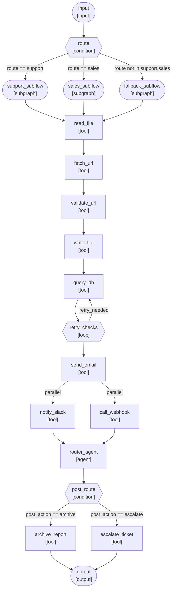
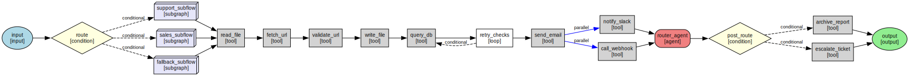
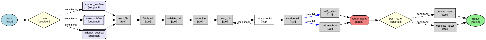

# Workflow Composition (Global + Subflows)

This guide shows how to **compose workflows** (a “global” workflow that contains other workflows)
and **mix deterministic components with agents**—similar to n8n-style deterministic steps
combined with AI agents.

We cover two complementary approaches:

1. **Flow composition** using `SubworkflowFlow` (wrap a pre-built graph inside another flow).
2. **Graph composition** using `SubgraphNode` + deterministic routing/tool nodes.

You’ll also see **Mermaid visualizations** generated from a `Graph` for documentation or
review.

---

## When to Use Workflow Composition

- You want **reusable subflows** (e.g., a “support intake” workflow used in multiple products).
- You need **deterministic orchestration** between agent steps (routing, validation, tools).
- You want a **global workflow** that orchestrates multiple subflows and aggregations.

---

## Approach 1: Flow Composition with `SubworkflowFlow`

`SubworkflowFlow` lets you run a pre-built `Graph` as a flow inside a larger workflow.

```python
import asyncio

from genxai import AgentFactory, Graph, SubworkflowFlow
from genxai.core.graph.nodes import AgentNode, InputNode, OutputNode
from genxai.core.graph.edges import Edge


async def build_subflow() -> Graph:
    """Build a reusable sub-workflow graph."""
    agent = AgentFactory.create_agent(
        id="sub_agent",
        role="Support Analyst",
        goal="Summarize the request",
        temperature=0.0,
        seed=42,
    )

    subgraph = Graph(name="support_subflow")
    subgraph.add_node(InputNode(id="input"))
    subgraph.add_node(AgentNode(id="sub_agent", agent_id=agent.id))
    subgraph.add_node(OutputNode(id="output"))
    subgraph.add_edge(Edge(source="input", target="sub_agent"))
    subgraph.add_edge(Edge(source="sub_agent", target="output"))
    return subgraph


async def main() -> None:
    subgraph = await build_subflow()
    subflow = SubworkflowFlow(subgraph)

    # Execute the subflow directly, or embed it inside a larger orchestration.
    result = await subflow.run({"ticket": "Login issue"})
    print("Subflow result keys:", list(result.keys()))


if __name__ == "__main__":
    asyncio.run(main())
```

**Notes**
- Use `temperature=0.0` and `seed` for deterministic agent behavior.
- A `SubworkflowFlow` can be invoked by a global orchestrator flow or graph.

---

## Approach 2: Graph Composition with `SubgraphNode`

When you want a **single global graph** to orchestrate deterministic steps and subflows,
use `SubgraphNode` plus deterministic routing nodes (e.g., `ConditionNode`).

```python
from genxai import AgentFactory
from genxai.core.graph.engine import Graph
from genxai.core.graph.nodes import (
    InputNode,
    OutputNode,
    ConditionNode,
    SubgraphNode,
    AgentNode,
    ToolNode,
    LoopNode,
)
from genxai.core.graph.edges import Edge, ConditionalEdge, ParallelEdge


def build_global_graph() -> Graph:
    graph = Graph(name="global_orchestrator")

    # Nodes
    graph.add_node(InputNode(id="input"))
    graph.add_node(ConditionNode(id="route", condition="route_rule"))
    graph.add_node(SubgraphNode(id="support_subflow", workflow_id="support_subflow"))
    graph.add_node(SubgraphNode(id="sales_subflow", workflow_id="sales_subflow"))
    graph.add_node(SubgraphNode(id="fallback_subflow", workflow_id="fallback_subflow"))

    router_agent = AgentFactory.create_agent(
        id="router_agent",
        role="Router",
        goal="Finalize routing decision",
        temperature=0.0,
        seed=42,
    )
    graph.add_node(ToolNode(id="read_file", tool_name="file_reader"))
    graph.add_node(ToolNode(id="fetch_url", tool_name="api_caller"))
    graph.add_node(ToolNode(id="validate_url", tool_name="url_validator"))
    graph.add_node(ToolNode(id="write_file", tool_name="file_writer"))
    graph.add_node(ToolNode(id="query_db", tool_name="sql_query"))
    graph.add_node(LoopNode(id="retry_checks", condition="retry_needed", max_iterations=2))
    graph.add_node(ToolNode(id="send_email", tool_name="email_sender"))
    graph.add_node(ToolNode(id="notify_slack", tool_name="slack_notifier"))
    graph.add_node(ToolNode(id="call_webhook", tool_name="webhook_caller"))
    graph.add_node(AgentNode(id="router_agent", agent_id=router_agent.id))
    graph.add_node(ConditionNode(id="post_route", condition="post_action"))
    graph.add_node(ToolNode(id="archive_report", tool_name="file_writer"))
    graph.add_node(ToolNode(id="escalate_ticket", tool_name="email_sender"))
    graph.add_node(OutputNode(id="output"))

    # Edges
    graph.add_edge(Edge(source="input", target="route"))
    graph.add_edge(ConditionalEdge(
        source="route",
        target="support_subflow",
        condition=lambda state: state.get("route") == "support",
    ))
    graph.add_edge(ConditionalEdge(
        source="route",
        target="sales_subflow",
        condition=lambda state: state.get("route") == "sales",
    ))
    graph.add_edge(ConditionalEdge(
        source="route",
        target="fallback_subflow",
        condition=lambda state: state.get("route") not in {"support", "sales"},
    ))
    graph.add_edge(Edge(source="support_subflow", target="read_file"))
    graph.add_edge(Edge(source="sales_subflow", target="read_file"))
    graph.add_edge(Edge(source="fallback_subflow", target="read_file"))
    graph.add_edge(Edge(source="read_file", target="fetch_url"))
    graph.add_edge(Edge(source="fetch_url", target="validate_url"))
    graph.add_edge(Edge(source="validate_url", target="write_file"))
    graph.add_edge(Edge(source="write_file", target="query_db"))
    graph.add_edge(Edge(source="query_db", target="retry_checks"))
    graph.add_edge(ConditionalEdge(
        source="retry_checks",
        target="query_db",
        condition=lambda state: state.get("retry_needed") is True,
    ))
    graph.add_edge(Edge(source="retry_checks", target="send_email"))
    graph.add_edge(ParallelEdge(source="send_email", target="notify_slack"))
    graph.add_edge(ParallelEdge(source="send_email", target="call_webhook"))
    graph.add_edge(Edge(source="notify_slack", target="router_agent"))
    graph.add_edge(Edge(source="call_webhook", target="router_agent"))
    graph.add_edge(Edge(source="router_agent", target="post_route"))
    graph.add_edge(ConditionalEdge(
        source="post_route",
        target="archive_report",
        condition=lambda state: state.get("post_action") == "archive",
    ))
    graph.add_edge(ConditionalEdge(
        source="post_route",
        target="escalate_ticket",
        condition=lambda state: state.get("post_action") == "escalate",
    ))
    graph.add_edge(Edge(source="archive_report", target="output"))
    graph.add_edge(Edge(source="escalate_ticket", target="output"))

    return graph
```

### Supplying Subgraphs at Runtime

`SubgraphNode` expects a `workflow_id`. The actual subgraph definition is supplied at runtime
via the execution state (e.g., `state["subgraphs"]`), which maps IDs to workflow definitions.

```python
subgraphs = {
    "support_subflow": {
        "nodes": [
            {"id": "input", "type": "input"},
            {"id": "agent", "type": "agent", "config": {"agent_id": "support_agent"}},
            {"id": "output", "type": "output"},
        ],
        "edges": [
            {"source": "input", "target": "agent"},
            {"source": "agent", "target": "output"},
        ],
    },
    "sales_subflow": {
        "nodes": [
            {"id": "input", "type": "input"},
            {"id": "agent", "type": "agent", "config": {"agent_id": "sales_agent"}},
            {"id": "output", "type": "output"},
        ],
        "edges": [
            {"source": "input", "target": "agent"},
            {"source": "agent", "target": "output"},
        ],
    },
}

state = {"subgraphs": subgraphs, "route": "support"}
# result = await graph.run(input_data={...}, state=state)
```

---

## Flow Visualization (Mermaid)

You can visualize the global graph (including subflows) using `Graph.to_mermaid()`
and embed the output directly in docs.

```python
graph = build_global_graph()
print(graph.to_mermaid())
```

**Example Mermaid Diagram**



> Tip: Mermaid is supported in GitHub Markdown. For local previews, see
> [GRAPH_VISUALIZATION](./GRAPH_VISUALIZATION.md).

---

## No-Code (YAML) Composition Example

If you prefer YAML, you can express deterministic routing + subflows in a single
workflow definition. Below is a **global workflow** that routes to two subflows
based on a deterministic condition.

```yaml
workflow:
  name: "Global Orchestrator"
  description: "Route to support or sales subflows"

  agents:
    - id: "router_agent"
      role: "Router"
      llm: "gpt-4"
      temperature: 0.0
      seed: 42

  tools:
    - name: "file_reader"
      description: "Read a file deterministically"
    - name: "api_caller"
      description: "Fetch structured data from a URL"
    - name: "url_validator"
      description: "Validate URL availability"
    - name: "file_writer"
      description: "Write a deterministic file output"
    - name: "sql_query"
      description: "Run a deterministic SQL query"
    - name: "email_sender"
      description: "Send notification email"
    - name: "slack_notifier"
      description: "Post a deterministic Slack notification"
    - name: "webhook_caller"
      description: "Invoke an outbound webhook"

  graph:
    nodes:
      - id: "start"
        type: "input"
      - id: "route"
        type: "condition"
        condition: "route_rule"
      - id: "support_subflow"
        type: "subgraph"
        workflow_id: "support_subflow"
      - id: "sales_subflow"
        type: "subgraph"
        workflow_id: "sales_subflow"
      - id: "fallback_subflow"
        type: "subgraph"
        workflow_id: "fallback_subflow"
      - id: "read_file"
        type: "tool"
        tool_name: "file_reader"
      - id: "fetch_url"
        type: "tool"
        tool_name: "api_caller"
      - id: "validate_url"
        type: "tool"
        tool_name: "url_validator"
      - id: "write_file"
        type: "tool"
        tool_name: "file_writer"
      - id: "query_db"
        type: "tool"
        tool_name: "sql_query"
      - id: "retry_checks"
        type: "loop"
        condition: "retry_needed"
        max_iterations: 2
      - id: "send_email"
        type: "tool"
        tool_name: "email_sender"
      - id: "notify_slack"
        type: "tool"
        tool_name: "slack_notifier"
      - id: "call_webhook"
        type: "tool"
        tool_name: "webhook_caller"
      - id: "post_route"
        type: "condition"
        condition: "post_action"
      - id: "archive_report"
        type: "tool"
        tool_name: "file_writer"
      - id: "escalate_ticket"
        type: "tool"
        tool_name: "email_sender"
      - id: "router"
        type: "agent"
        agent: "router_agent"
      - id: "end"
        type: "output"

    edges:
      - from: "start"
        to: "route"
      - from: "route"
        to: "support_subflow"
        condition: "route == 'support'"
      - from: "route"
        to: "sales_subflow"
        condition: "route == 'sales'"
      - from: "route"
        to: "fallback_subflow"
        condition: "route not in ['support', 'sales']"
      - from: "support_subflow"
        to: "read_file"
      - from: "sales_subflow"
        to: "read_file"
      - from: "fallback_subflow"
        to: "read_file"
      - from: "read_file"
        to: "fetch_url"
      - from: "fetch_url"
        to: "validate_url"
      - from: "validate_url"
        to: "write_file"
      - from: "post_route"
        to: "archive_report"
        condition: "post_action == 'archive'"
      - from: "post_route"
        to: "escalate_ticket"
        condition: "post_action == 'escalate'"
      - from: "archive_report"
        to: "end"
      - from: "escalate_ticket"
        to: "end"
      - from: "write_file"
        to: "query_db"
      - from: "query_db"
        to: "retry_checks"
      - from: "retry_checks"
        to: "query_db"
        condition: "retry_needed == true"
      - from: "retry_checks"
        to: "send_email"
      - from: "send_email"
        to: "notify_slack"
      - from: "notify_slack"
        to: "call_webhook"
      - from: "call_webhook"
        to: "router"
      - from: "router"
        to: "end"
```

The referenced subflows are supplied at runtime using `state.subgraphs` (same as the
Python example above).

---

## Optional: Render a PNG/SVG Diagram (GraphViz)

If you want a rendered diagram for slides or docs, export `to_dot()` and render.
Prebuilt assets are available:

- DOT: `docs/diagrams/workflow_composition.dot`
- SVG: `docs/diagrams/workflow_composition.svg`
- PNG: `docs/diagrams/workflow_composition.png`
- JSON: `docs/diagrams/workflow_composition.json`

You can also generate Mermaid/DOT/SVG/PNG and a JSON snapshot with the script:
`examples/code/workflow_composition_visualize.py`.

**JSON snippet (graph structure):**

```json
{
  "name": "global_orchestrator",
  "nodes": [
    {"id": "input", "type": "input"},
    {"id": "route", "type": "condition"},
    {"id": "support_subflow", "type": "subgraph"},
    {"id": "sales_subflow", "type": "subgraph"},
    {"id": "fallback_subflow", "type": "subgraph"},
    {"id": "read_file", "type": "tool"},
    {"id": "fetch_url", "type": "tool"},
    {"id": "validate_url", "type": "tool"},
    {"id": "write_file", "type": "tool"},
    {"id": "query_db", "type": "tool"},
    {"id": "retry_checks", "type": "loop"},
    {"id": "send_email", "type": "tool"},
    {"id": "notify_slack", "type": "tool"},
    {"id": "call_webhook", "type": "tool"},
    {"id": "post_route", "type": "condition"},
    {"id": "archive_report", "type": "tool"},
    {"id": "escalate_ticket", "type": "tool"},
    {"id": "router_agent", "type": "agent"},
    {"id": "output", "type": "output"}
  ],
  "edges": [
    {"source": "input", "target": "route", "condition": null},
    {"source": "route", "target": "support_subflow", "condition": "<lambda>"},
    {"source": "route", "target": "sales_subflow", "condition": "<lambda>"},
    {"source": "route", "target": "fallback_subflow", "condition": "<lambda>"},
    {"source": "support_subflow", "target": "read_file", "condition": null},
    {"source": "read_file", "target": "fetch_url", "condition": null},
    {"source": "fetch_url", "target": "validate_url", "condition": null},
    {"source": "validate_url", "target": "write_file", "condition": null},
    {"source": "write_file", "target": "query_db", "condition": null},
    {"source": "query_db", "target": "retry_checks", "condition": null},
    {"source": "retry_checks", "target": "query_db", "condition": "<lambda>"},
    {"source": "retry_checks", "target": "send_email", "condition": null},
    {"source": "send_email", "target": "notify_slack", "condition": null, "parallel": true},
    {"source": "send_email", "target": "call_webhook", "condition": null, "parallel": true},
    {"source": "notify_slack", "target": "router_agent", "condition": null},
    {"source": "call_webhook", "target": "router_agent", "condition": null},
    {"source": "router_agent", "target": "post_route", "condition": null},
    {"source": "post_route", "target": "archive_report", "condition": "<lambda>"},
    {"source": "post_route", "target": "escalate_ticket", "condition": "<lambda>"},
    {"source": "archive_report", "target": "output", "condition": null},
    {"source": "escalate_ticket", "target": "output", "condition": null}
  ]
}
```

**Inline preview (SVG):**



_Figure: Global workflow routing to two subflows (SVG preview)._ 

**Inline preview (PNG):**



_Figure: PNG preview for environments that don’t render SVG._

```python
graph = build_global_graph()
dot_output = graph.to_dot()

with open("workflow.dot", "w") as f:
    f.write(dot_output)
```

```bash
# PNG
dot -Tpng workflow.dot -o workflow.png

# SVG
dot -Tsvg workflow.dot -o workflow.svg
```

> GraphViz isn’t installed by default in all environments. If `dot` is missing,
> see [GRAPH_VISUALIZATION](./GRAPH_VISUALIZATION.md) for install instructions.

---

## Deterministic Components Checklist

- **Routing logic**: `ConditionNode`, `RouterFlow`, `ConditionalFlow`, `SelectorFlow`.
- **Deterministic agents**: `temperature=0.0`, set `seed`.
- **Deterministic tools**: use `ToolNode` for fixed operations or validations.
- **State-driven control**: set `state` keys to trigger route/branching deterministically.

---

## See Also

- [FLOWS](./FLOWS.md) – orchestration patterns
- [GRAPH_VISUALIZATION](./GRAPH_VISUALIZATION.md) – diagram generation
- [WORKFLOW_BEST_PRACTICES](./WORKFLOW_BEST_PRACTICES.md) – design guidance
- [examples/code/flow_subworkflow_example.py](../examples/code/flow_subworkflow_example.py)